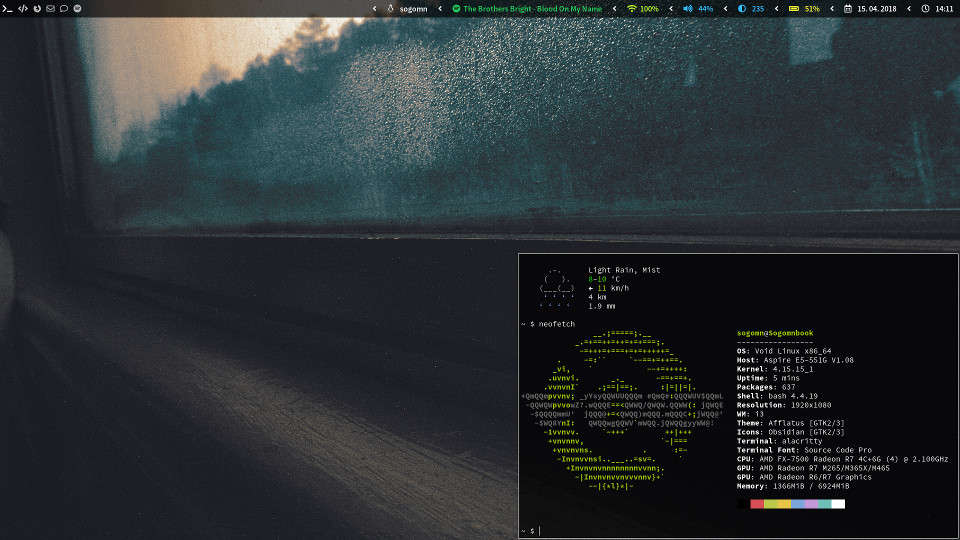

# Void Linux / i3-gaps dotfiles

### Required Void packages:
* compton
* curl
* dunst
* feh
* font-awesome
* font-sourcecodepro
* gscreenshot
* i3-gaps
* i3blocks
* pywal
* redshift
* rofi
* source-sans-pro
* vim
* xclip
* xorg

### Required Cargo packages:
* alacritty

### Theme:
* Vimix

### Icons:
* Paper

### Mouse:
* BMZ



---

### File structure
This configuration requies the following directories in `~/`:
```
.
+ --- Documents
|     + --- spotify_token
+ --- Images
|     + --- wallpapers
|           + ...
+ --- Scripts
|     + --- blocks
|           + ...
|     + ...
```

---

### Navigation
Default modifier is the windows key

|Key|Function|
|---|---|
|Mod + Enter|Open terminal|
|Mod + D|Open application launcher|
|Mod + Number|Switch workspace|
|Mod + Shift + Number|Move window to workspace|
|Mod + Arrow key|Switch focus|
|Mod + Shift + Arrow key|Move window|
|Mod + Q|Close window|
|Mod + Space|Put window in floating mode|
|Mod + F|Put window in fullscreen mode|
|Mod + S|Toggle focus between tiling and floating|
|Mod + A|Switch between horizontal and vertical tiling direction|
|Print|Take a screenshot by selecting a rectangle with the mouse|
|Shift + Print|Save a screenshot to `~/Images/screenshot.png`|
|Mod + Shift + R|Reload i3|
|Mod + Shift + E|Exit i3|
